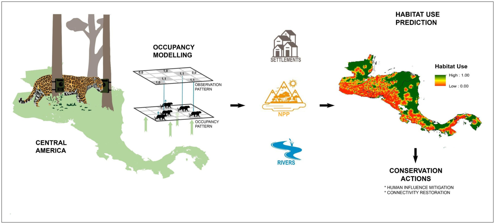

# Calderon et al. (2022) *Animal Conservation*

> **A.P. Calderón**, **J. Louvrier**, **A. Planillo**, D. Araya-Gamboa, S. Arroyo-Arce, M. Barrantes-Núñez, J. Carazo-Salazar, D. Corrales-Gutiérrez, C.P. Doncaster, R. Foster, M.J. García, R. Garcia-Anleu, B. Harmsen, S. Hernández-Potosme, R. Leonardo, D.M. Trigueros, R. McNab, N. Meyer, R. Moreno, R. Salom-Pérez, A. Sauma Rossi, I. Thomson, D. Thornton, Y. Urbina, V. Grimm & **S. Kramer-Schadt** (2022). Occupancy models reveal potential of conservation prioritization for Central American jaguars. *Animal Conservation* 25(5):680-691. DOI: [10.1111/acv.12772](https://doi.org/10.1111/acv.12772)

Understanding species-environment relationships at large spatial scales is required for the prioritization of conservation areas and the preservation of landscape connectivity for large carnivores. This endeavour is challenging for jaguars (*Panthera onca*), given their elusiveness, and the local nature of most jaguar studies, precluding extrapolation to larger areas. We developed an occupancy model using occurrence data of jaguars across five countries of Central America, collected from camera-trap studies of 2–12 months' duration, deployed over an area of 14,112 km2 from 2005 to 2018. 
Our occupancy model showed that habitat use of jaguars increased with primary net productivity and distance to human settlements, and decreased with distance to rivers. Detection of the species was related to survey effort and research team identity. Within the jaguar extent of occurrence, 73% was deemed suitable for the species, with 47% of it lying within Jaguar Conservation Units (JCU) and 59% of JCU land being legally protected. Suitable areas were divided into four distinct clusters of continuous habitat shared across country borders. However, large areas of predicted low habitat suitability may constrict connectivity in the region. The reliability of these spatial predictions is indicated by the model validation using an independent dataset (AUC = 0.82; sensitivity = 0.766, specificity = 0.761), and concordance of our results with other studies conducted in the region. 
Across Central America, we found that human influence has the strongest impact on jaguar habitat use and JCUs are the main reservoirs of habitat. Therefore, conservation actions must focus on preventing habitat loss and mitigating human pressure, particularly within the clusters of continuous areas of high suitability, and on restoring habitat to foster connectivity. The long-term persistence of jaguars in the region will depend on strong international cooperation that secures jaguar populations and their habitat across Central American borders.
  
---
  
## Methodology

The methodological framework we present here applies site-occupancy models to estimate the occurrence probability of jaguars at grid-cells j. Several biologically plausible candidate models are run within a single-state, single-season occupancy framework, in which each unique site-year combination sampled (‘grid cell – year’) is treated as an independent site.  We also test for potential year effects by running a model version with year as random effect for each of the model in the candidate set. We evaluate the top ranking model using MacKenzie & Bailey goodness of fit test (GOF) and the Dunn–Smyth residuals for both its occupancy and detection components. 

## Data

This database includes the surveyed sites in the rows, and the detection histories and covariates in the columns. We have anonymized the information on the team identities, site names and any spatial coordinates on this data publicly available, given the sensitive nature of jaguar locations, poaching concerns and previous agreements with funders and data owners.

## Scripts

The R scripts are located in the `R` subfolder.

`1_Singleseason_JaguarHabitatUse`: fit the single-state, single-season occupancy models. 

`2_Dunn-Smyth residuals_top_model`: run the Dunn–Smyth residuals of the top ranked model obtained in the occupancy modeling stage. It is a modified version from the code provided in  Warton et al. 2017, Graphical diagnostics for occupancy models with imperfect detection (https://doi.org/10.1111/2041-210X.12761).

